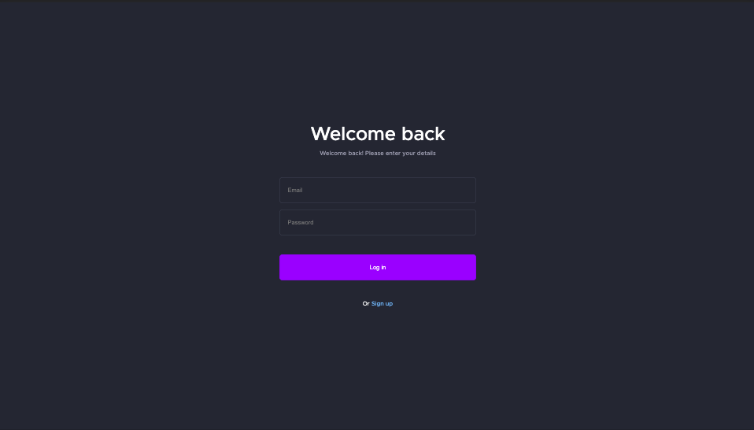

# React dashboard app

## 🔹About the app:
- The app was created strictly to the design and is compatible only with devices that have a width of 1920px and more. Adaptation on smaller devices can be implemented in further updates.
 - Data for all the blocs was fetched from a backend server with axios library.
 - When you click on 'Username' on the top right side of the dashboard it will change the page to Login, where you can press on a purple button to move back to the dashboard or click on 'Sign up' to move to the Register page. User registration and login logic are in development.

## 🔹Creator
> - Anton Iskryk - iskryk.anton@gmail.com

## 🔹Application link:

[DEPLOYED APPLICATION](https://anton-iskryk.github.io/react_dashboard/)

## 🔹Technologies:

React/React-Router/TypeScript/axios/styled-components/HTML5/CSS3

## 🔹App screenshots:

Dashboard:

Register page:

Login page:

